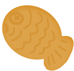

&nbsp;&nbsp;&nbsp;
&nbsp;&nbsp;&nbsp;

# 맛인드맵

<a href="https://musical-travesseiro-2513c7.netlify.app">웹사이트 보러가기</a>
  

## 어떤 웹사이트인가?

<pre>맛인드맵 웹사이트는 웹사이트 사용자들이 직접 타코야끼, 붕어빵, 떡볶이   포장마차의 위치를 지도에 추가하여 공유하는 웹사이트입니다.</pre>

  

## 주요 기능 

|기능|설명|
|:--:|--|
|위치 검색|▸ 타코야끼, 붕어빵, 분식별로 위치를 검색할 수 있는 기능| 
|위치 공유|▸ 사용자가 직접 포장마차 위치를 추가할 수 있는 기능|
|북마크|▸ 검색한 포장마차의 위치를 북마크하여 따로 볼 수 있는 기능|

  

## 웹사이트 사용 방법

 
1.  <a>https://musical-travesseiro-2513c7.netlify.app</a> 웹사이트에 들어간다.  
2. 메인 페이지에서 찾고 싶거나 위치를 추가하고 싶은 음식의 아이콘을 클릭한다.  
3. 검색창에 원하는 위치를 검색하고 원하는 결과를 클릭한다.  
4. 지도에 위치를 추가하고 싶다면 위치 추가, 북마크에 넣고 싶다면 북마크 추가 버튼을 누른다  
5. 북마크에서 원하는 위치를 확인할 수 있다.  
6. 북마크에 넣은 위치의 채워져 있는 하트를 취소하면 북마크 해체할 수 있다.